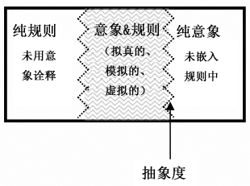
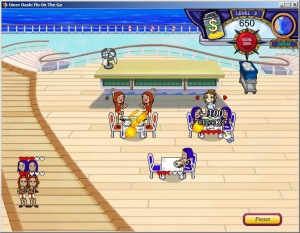
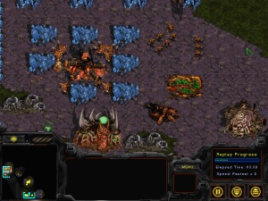
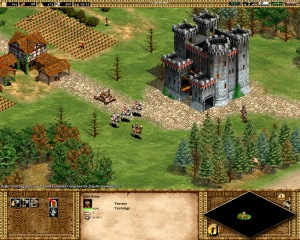
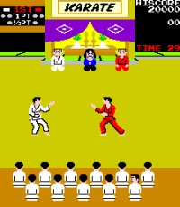
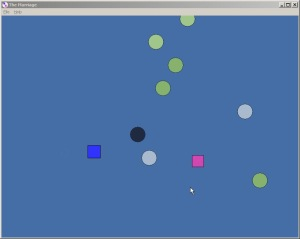
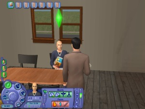
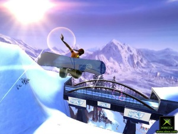

### 游戏抽象度 
作者：Jesper Juul        译者：陈佶 

发表于2007年9月24-28日东京数码游戏研究协会（DiGRA）大会 

Jesper Juul: "A Certain Level of Abstraction". In Situated Play: DiGRA 2007 Conference Proceedings, edited by Akira Baba, 510-515. Tokyo: DiGRA Japan, 2007.

<http://www.jesperjuul.net/text/acertainlevel>

Translated by Ji Chen.

### 摘要 
本文旨在研究游戏的抽象度(levels of abstraction)：模拟类游戏（representational games）展现了一个虚拟世界，然而在这个世界中，玩家只能进行有限的特定动作；虚拟世界所展现的细节是有限的。 

本文把游戏中的抽象分为三类：作为游戏核心元素的抽象性，玩家在游戏过程中所识别的抽象概念，玩家在追求游戏技能最优化过程中进行的抽象化。 

本文在最后提出，抽象与“游戏魔圈”（magic circle of games，译注：有理论认为，有一个明确的分界线把现实世界和游戏世界区分开来，此界限称为游戏魔圈）和游戏规则息息相关。

### 作者关键词 
抽象性, 模拟, 再现, 虚拟, 玩家反馈, 魔圈.

### 引言 
电子游戏已经快有五十年历史了，而游戏的历史则长达数千年。无论游戏制作者还是玩家，都深深被已经形成的游戏文化所影响：制作者通过借鉴并发展游戏的传统和旧有类型，开发新的游戏；玩家则借助对游戏传统的理解和玩过的旧游戏更好地上手新游戏。 

从事电子游戏研究的学者也同样深受游戏文化的影响，很多游戏传统已经被不自觉地被当作理所当然。恐怕问一些幼稚的问题更利于我们的研究。我将以此开头：为何我不能为所欲为？

### 行有所止

    
图1.《料理妈妈（Cooking Mama）》（2006年，Office Create出品）

《料理妈妈（Cooking Mama）》（图1, 2006年，Office Create出品）是一款有关烹调的游戏：要做出一道道佳肴，玩家必须准备作料、切蔬菜以及控制炉子的火力。 

这款游戏有着双重含义：游戏呈现了一个厨房，厨房里的一个人，一些作料——亦即一个虚拟世界；然而游戏又显示这不是真正的厨房。并非所有能在厨房里做的事情，玩家都可以做到：《料理妈妈》允许玩家切黄瓜，但是只能切成特定的形状；玩家可以煮饭做菜，但却不能订外卖。 

正如其它模拟类游戏，《料理妈妈》也有一定的抽象程度——玩家只能进行某些特定操作，除此之外，现实世界要么粗略地嵌入游戏规则（例如作料），要么被简化地呈现（例如桌布），要么干脆不出现在游戏中（例如厨房外的世界）。 

如果我们假设游戏由两个互补的部分即“规则（rules）”和“意象（fiction）”组成[^5]，那么游戏内容只可能有三种：纯粹而未被嵌入规则的意象（例如游戏的过关故事），纯粹而未用意象诠释的规则（例如玩家的多条生命），或者是两者之间，即被具体的意象赋予了意义的规则（汽车可以驾驶，鸟可以飞等）。（图2）规则和意象的结合，有时被称为“虚拟”（virtual）或者“模拟”（simulation）[^1]。 

    
图2. 抽象度：纯粹意象和嵌入规则的意象的分界线 

所谓“抽象度”，关乎游戏中的纯意象和嵌入规则的意象的划分。

### 设计中的抽象性 
为了说明“抽象性”，可以用自然语言来打个比方。语言可以从不同水平的细节去描绘一个动作。譬如“去工作”这一动作，可以被描述为“去工作”，也可以被描述为一连串的步骤，例如“打开前门，走去地铁，乘坐地铁，离开地铁，走去工作”，也可以细化为去工作的具体路线，甚至具体每块肌肉的收缩[^i]。 

这表明，对于某个动作，并没有一个理所当然的细述程度。仍以烹饪为例，任何水平的细节，从选择餐盘到控制拿刀的手的肌肉，都是可以想象得到的。然而，改变抽象度会使得料理妈妈成为不同的游戏：抽象度确定了特定的游戏及其类型。举例来说，休闲游戏《美女餐厅：忙碌的菲奥》（图6, 2006年PlayFirst出品）是经营一家餐厅的游戏。我们可以相信，这游戏里的厨师也如《料理妈妈》里一样炒菜做饭，但是这个行为却不由玩家操作。尽管这两款游戏可以被认为都是同一个虚拟世界的一部分，它们却是完全不同的两款游戏，而这恰恰因为其抽象度不同。

    
图3.美女餐厅：忙碌的菲奥（2006年PlayFirst出品）

抽象度就是玩家可操作的程度：所有玩家可以实现的行为[^ii]。

### 抽象概念的识别 
这里对于《料理妈妈》和《美女餐厅：忙碌的菲奥》的讨论，是玩过游戏之后才有的事后观感。然而实际上，“玩游戏”本身就是探索抽象概念的过程。作为玩家，当我们开始新游戏，尤其是新类型的游戏时，我们并不知道其抽象度。考察两款经典的即时战略游戏，《星际争霸（StarCraft）》（1998年Blizzard出品）和《帝国时代》（1999年Ensemble Studios出品）（图4）。 

    
图4. 《星际争霸（StarCraft）》（1998年Blizzard出品）和《帝国时代2》（1999年Ensemble Studios出品）

这两款游戏给玩家的第一印象大相径庭，并且取决于玩家玩即时战略类游戏的经验。

**新手玩家**会倾向基于某些他们已经知道的东西（在这里即指游戏的意象）对游戏做出猜测。玩家可以从其他媒体中认识到《帝国时代2》中的单位和设置：骑士被猜测为具有某种战斗功能的单位；投石机则可能用于攻击城堡。游戏中有城镇，还有农田。农田上的人大概可以通过某种方式采集食物。通过这些设置，玩家可以猜测游戏的规则。然而，对于不熟悉即时战略的玩家而言，《星际争霸》（尤其是图中的虫族）只提供了极有限的关于规则的信息：那些蓝色的晶体是什么？那些小生物是干什么的？这使得《帝国时代II》更容易上手，因为玩家可以通过其意象领会游戏规则。 

**有经验的玩家**则可以通过单位的数量、资源的布置、第三人称视角以及熟悉的操作界面，识别这两款游戏的游戏类型。也就是说，老玩家开始游戏时，已经对游戏的规则和普遍的可操作点有所认识：指派单位移动时应选择目的地，但不需设置具体路径；把精力放在战斗上，而不是生产军粮上；接受人能够在几分钟内被“建造”出来的设定。然而，即使是老玩家也不会知道一款新游戏的抽象度到底有多少。或许这款游戏中增加了政治或者社会结构(对即时战略游戏而言的新元素)？或许在这款游戏中，采集资源的单位会变得疲劳？ 
这表明，当玩家玩游戏时，他们对游戏的观点是随着时间不断改变的。制作者或者理论家的观点却是对游戏的回顾，即一个花了足够时间发掘出游戏所有秘密的“理想玩家”的观点。

### 问题还是机会？ 
借助适当的技术和足够的资源，我们可以制作一款能模拟厨房中任意水平的细节的照片般逼真的游戏。这个无疑是个诱人的遐想。这即是所谓对“虚拟现实”或“全息模拟”[^7]的梦想。梦想拥有一个无抽象度的游戏体验：一款可能做任何事情并且一切事物都被模拟到无限具体的游戏。在《料理妈妈》中，虚拟现实就意味着我们终于可以订外卖或者像在真正的厨房里一样做菜了。 

Aarseth[^1]提出，游戏中可开的门和不可开的门之间，有重要的本质区别。Aarseth认为后者算不上是模拟的(simulated)，因为它们并没有“开”这一功能。这一论断的前提假设是，对于某个物件，我们可以列出一个功能清单，只有当这个物件拥有所有这些功能时，它才算是游戏的一部分。然而，从另一方面来说，普通的门有无限种可能的功能，例如让人们进入，把人们拦在外面，作为绘画素材，从铰链上拆卸下来等等。任何物品或动作在游戏中被“完全地”模拟，是难以想象的。 

随着电子游戏科技的发展和游戏研发经费的提升，完美拟真的构想已经走进时代前沿。然而我们也听到了一些批评的声音。正如游戏设计师Frank Lantz所言： 

>我认为在业内有一个广泛传播、基本未经检验的信念：游戏正向着无限的精细和完美拟真的方向发展。这就是游戏的命运。最终演变成“星际迷航式”的全息甲板，一个可以以假乱真的完美拟真。
>
>[……]
>
>即便你可以通过某些魔法，创造这样实际上不可能的完美的虚拟世界，你又将置身何地？你将会迷上这个世界里的某个游戏。你需要用这个世界中的虚拟石块制作国际象棋。这看起来就像是又回到了起点。我可不想还是玩象棋。我想玩的是把高度的虚拟和象棋结合起来的游戏。这需要的是一种轻度的对接。这需要对拟真的不完美的尊重。这种不完美正是你所需的一部分。[^11]

进一步，可以说抽象的作用不仅仅在于简单地把游戏与其所重现的内容区别开来，还在于为其特定的目的服务。Chaim Gingold曾用日本园艺美学与游戏发展史作对比： 

>一个迷你花园，例如一只雪花玻璃球、一套火车模型或者一个鱼缸，是完整的；它不缺少什么，也不多出什么。明确的边界（空间的和非空间的）、全景以及一个确定不变的抽象度，确保这个迷你世界真实可信、完整，并且对制作者和游戏者来说，都易于掌控。[^2]

Gingold的观点将“抽象”描述为一种有效的重现世界的方法。作为补充，一个观点认为既然游戏可以同时既是抽象的又是具象的，当任何素材被转换为游戏的形式，我们都可以看到抽象性的存在。考察图5所示的格斗游戏《死或生4（Dead Or Alive 4）》（2005年Tecmo出品）。 

    
图5. 《死或生4（Dead Or Alive 4）》（2005年Tecmo出品）：三维世界中的二维游戏

即便在这精美的三维游戏世界中，格斗仍然被限制在一条轴线上，玩家与玩家永远正面相对。这是有多种理由的——由于玩家只能够从对手的正前方或正后方发动攻击，使得动作种类有限，因此更易于掌握，这使得游戏更容易上手。更重要的是，二维的游戏机制是这类游戏的传统，这可以追溯至《街头霸王（Street Fighter）》（1987年Capcom出品）或《空手道冠军（Karate Champ）》（图6,1984年Data East出品）。 

    
图6. 《空手道冠军（Karate Champ）》（图6,1984年Data East出品）：2D世界中的2D游戏.

这是格斗类游戏中保留的抽象性的例子——即便科技发展使得在游戏中取消这一抽象成为可能。游戏设计和游戏体验都不仅仅追求现实、逼真，也同样会向游戏的历史和特定游戏类型的传统看齐。格斗类游戏保持着在一条轴线上对打的传统，因此证明了游戏发展史并非简单地被技术的发展而驱动的。实际上，一个被游戏玩家和游戏设计师所熟悉的游戏类型，可以稳定长久地留存下去。

### 抽象的是什么？ 
在《料理妈妈》的例子中，我曾说这是“一款有关烹饪的游戏”：如果我们假设真的如此，可以很轻易地指出大量在现实厨房中可能，在游戏中却不存在的动作。从玩家的角度来看，这要求能够把对虚拟世界的预期和游戏实际提供的可能性做对比。换句话说，把游戏作为某种抽象的体验，取决于玩家对“游戏所抽象的是什么”的识别。考察图7的游戏。此款游戏中有许多不同颜色的几何体。 

    
图7. （2006年Humble出品）

这款Rod Humble制作的实验性游戏叫做《婚姻（The Marriage）》，它被设计来表现婚姻的紧张关系和发展。两个方块代表夫妻，圆形则表示外界对此关系的影响。如作者所说，玩家无法仅凭观看游戏对此获得直观认识。 

>这是一款需要解释的游戏。这已经保证它会是失败的游戏。然而，任何人面对一种新的艺术形式，至少也总有个开始，而且让受众无理由地抛弃一个作品（即便它并不成功）也是不道德的。而这理由，大概是因为玩这么一个小游戏，还需要阅读上百字的说明。[^12]

如果玩家理解《婚姻》表现的是一场婚姻而已，这款游戏也只能被当作对一种关系的发展的极端抽象。信息交流是模拟类游戏的必备要素：必须通过某种形式说服玩家把游戏当成某种事物的重现。在这之后，玩家才能考虑他或她对游戏的预期和游戏中的实际情况的差别。在《婚姻》中，其游戏名称当然暗示了这款游戏可以被诠释为婚姻的模拟，然而作者仍然觉得需要更进一步解释这个游戏： 

>各方块的大小表示了此人在婚姻关系中所占据的空间。举例来说，我们常说某人在婚姻关系或其人格中，其自我膨胀。在游戏中，这将会是一个方块大到使得另一个方块被限制在它的空间之内，无法与圆形接触，并且更重要的是，无法与各边缘相接。[^12]

### 玩家为改进游戏策略而进行的抽象 
玩一个游戏就是学习并且探索游戏的抽象度。此外，游戏通常会驱使玩家改进其游戏策略，而这似乎会改变玩家对游戏的看法。正如上文中关于即时战略游戏玩家的讨论，一个有经验的老玩家可能把游戏理解为一个游戏类型的一种，而不了解这种游戏类型的新玩家则可能会利用其意象来理解游戏中有哪些可能的操作。在一项关于第一人称射击游戏玩家的研究中，Retaux和Rouchier[^9]发现，对游戏的精通，通常与降低画面细节相伴随。可以说，这是对游戏元素的关注点的极大转变——从游戏意象转变到游戏规则[^iii]。在某些类型的游戏中，这是普遍的：刚开始游戏的玩家会关注其意象，到了最后，则只会把玩游戏当作一个最优化其策略的机会。然而，由于心理学上的原因，不同的游戏会有很大的差别。 

另一种关于技巧习得的理论则探究了用户如何学习把任务相关信息从任务无关信息中分辨出来： 

>[…]我们认为人们通过实践，会学习如何把任务相关信息从任务无关信息中分离出来，并且只处理与任务有关方面的信息。因此，在技能获得过程中的早期处理的信息可能与晚期处理的信息有着质的不同。[^表现的进步]可能至少部分反映了处理的信息量的减少而非任务的各环节的执行效率提升。[^3]

任何强调目标的或竞技性强的游戏都会驱使玩家提升其表现，因而推动玩家接受更少的信息，以便只思考与当下任务相关的东西。如果游戏的意象与玩家的任务不相关，玩家把游戏当作一款抽象的游戏来玩是有可能的。 

忽略意象是指当你想到这款游戏时，你仅仅通过思考游戏规则而不会利用你从意象中得到的讯息来制定游戏策略。在国际象棋这样的游戏中，这一点非常明显：在不关心每个棋子的社会角色的条件下玩象棋是可能的，而且即便想到了棋子的社会角色，似乎也不会对玩象棋有什么帮助。从另一方面来说，尽管《模拟人生2（Sims 2）》（图8，2004年Maxis出品）理论上可以被当作一款拥有大量包含了可优化的数值的实体的抽象游戏来玩，不用感性的方式理解游戏人物的玩法仍然是难以想象的[^iv]。 

    
图8. 《模拟人生2（Sims 2）》（2004年Maxis出品）

最后，玩家对游戏的态度也不能被简单地归一为“优化策略”：玩家也可能会对意象有某种追求——很多玩家渴望沉浸在虚拟世界中。

### 空间：无法抽象的东西 

    
图9. 《极限滑雪3 （SSX3）》（2003年EA Canada出品）

在滑雪游戏《极限滑雪3 （SSX3）》（图9，2003年EA Canada出品）的里面，并没有真的空间，也没有真的雪、滑雪者和山。这类东西，诸如山脉的空间分布和自然的物理定律的一定程度的抽象版本，只不过是被嵌入在游戏规则中。关于空间的论题，Klevjer提出：“规则与意象的模式面临被打破的危险。”[^6]

Klevjer有一个观点：通过分析，我们可以解释为什么这里的空间是一个虚拟的意象，但是却难以在玩游戏时不把它看成空间。电子游戏中的空间是特殊的，因为多数电子游戏都会在一个空间中展开，也因为通常空间既是游戏意象中的一部分，也深植于规则当中。《模拟人生2》可以被当作一个抽象的数字游戏来玩，同样，《极限滑雪3》也可以：这会涉及一长串的计算，以便求解哪几个变量在数值上相近等问题。这实际上会让游戏变得非常难玩。 

大多数电子游戏都有一个直观的映射，要么把二维空间和二维空间对接起来，要么像在三维游戏中那样把屏幕的二维空间与游戏世界中的三维空间挂钩。而上文提到的《婚姻》，却用二维空间隐喻地表现了一种人际关系——非空间概念的空间化阐述。电子版本的纸牌游戏则是另一个空间可以被玩家抽象化的例子，因为屏幕上的空间布局对玩家在游戏中的表现没有影响。 

人类并不是通用计算器：我们对数据的全面处理能力是有限的，但是在某些方面却有特长。让电脑程序执行一系列复杂的数学运算是很简单的，但给一个角色编程，使其能够在复杂地形中寻路，并且不让观者感到它愚笨，却相对麻烦得多。与电脑相比，人类普遍拥有惊人的空间能力。这也就意味着但凡能够以空间的形式处理的问题，人类都会倾向以空间化的手段解决。这就是为什么对玩家来说，很难把游戏中的空间抽象出来。

### 迷上这个世界里的某个游戏 
Lantz所说“迷上这个世界里的某个游戏”，讲的是为了创造一个游戏，需要减少给玩家提供的可能性。巧合的是，这与Salen和Zimmerman对游戏规则就是对玩家活动的限制的说法不谋而合： 

>**规则限制玩家行为**。规则的首要作用就是限制玩家的活动。如果你正在玩Yatzee（译注：一种抛骰子并按特定规则算分的游戏），畅想一下所有你可以用骰子做的事情：你可以用火来照亮它们，你可以咬它们，可以用它们来玩杂耍，或者用它们制作首饰。[^10]

从这个角度来说，在非电子游戏中也有类似抽象度的概念：在足球或篮球场上，规则决定了什么可行，什么又被禁止，这可以被认为是某种抽象，某种把现实世界的特定部分从游戏中去除的抽象。足球只能够用特定的方式去操控；棒球运动员实际上是在几个分离的垒之间的一维直线上奔跑。从这个角度来说，区分游戏之内和游戏之外的游戏魔圈[^4]，不仅仅是一个可见的空间界限，还可以认为它把每一个物体、动作和玩家划分为游戏内的部分和游戏外的部分。就像足球是某种对现实世界的多个方面的移除亦即抽象，《生或死4》是对格斗的抽象，而一个电子游戏版本的足球则是对真正的足球赛的抽象。 

从玩家的角度来看，对抽象性的体验是固定的：玩家必须首先识别游戏类型和意象，然后开始探索游戏中的抽象性——什么东西可以捡起来？什么动作是允许的？之后则可能会在游戏过程中，把游戏的意象和设置进行抽象化的剥离。 

在电子游戏理论中，某些经久不衰的讨论可能实际上是关于选择的，选择用新手的视角还是全知者的回顾分析。然而我们无从选择：其实玩游戏就是不断建立并改变对游戏的理解的过程。 

对游戏，有第一印象，也有最终印象。玩家捡起一款游戏，探索，然后放下。

#### 参考游戏
1. Blizzard Entertainment. StarCraft. Blizzard Entertainment, 1998. (PC)
2. Capcom. Street Fighter. 1987. (Arcade)
3. Data East. Karate Champ. 1984. (Arcade)
4. EA Canada. SSX 3. EA Sports Big 2003. (Xbox)
5. Ensemble Studios. Age of Empires II. Microsoft, 1999. (PC)
6. Humble, Rod. The Marriage. 2006. (PC). <http://www.rodvik.com/rodgames/> (Accessed June 1st 2007.)
7. Infogrames. North & South. 1989. (Amiga)
8. Maxis. The Sims 2. Electronic Arts, 2004. (PC)
9. Office Create. Cooking Mama. Majesco, 2006. (Nintendo DS)
10. PlayFirst. Diner Dash: Flo on the Go. PlayFirst, 2006. (PC)
11. Tecmo. Dead or Alive 4. 2005. (Xbox 360)

[^1]: Aarseth, Espen: "Doors and Perception: Fiction vs. Simulation in Games". Digital Arts and Culture Conference, Copenhagen 2005.
[^2]: Gingold, Chaim. Miniature Gardens & Magic Crayons: Games, Spaces, & Worlds. Master's thesis, Georgia Institute of Technology 2003, pp. 7-8. <http://www.slackworks.com/~cog/writing/thesis/>
[^3]: Haider, Hilde, and Frensch, Peter A. "The Role of Information Reduction in Skill Acquisition". Cognitive Psychology no. 30 (1996), pp. 340-337.
[^4]: Huizinga, Johan. Homo Ludens. Boston: The Beacon Press, 1950, p.10.
[^5]: Juul, Jesper. Half-Real: Video Games between Real Rules and Fictional Worlds. Cambridge, Massachusetts: MIT Press 2005.
[^6]: Klevjer, Rune. What is the Avatar? Fiction and Embodiment in Avatar-Based Singleplayer Computer Games. Ph.D. dissertation. University of Bergen, 2006, p. 61.
[^7]: Murray, Janet. Hamlet on the Holodeck. New York: The Free Press, 1997.
[^8]: Pearce, Celia. "Sims, BattleBots, Cellular Automata God and Go. A Conversation with Will Wright". Game Studies, volume 2, issue 1. 2002. <http://www.gamestudies.org/0102/pearce/>
[^9]: Retaux, Xavier and Juliette Rouchier. "Realism vs. Surprise and Coherence: Different Aspect of Playability in Computer Games". Paper presented at the Playing With the Future conference, Manchester, April 5th-7th 2002.Abstract:  <http://www.cric.ac.uk/cric/events/PWF/abstracts/retaux.htm> (accessed February 1st, 2007)
[^10]: Salen, Katie and Eric Zimmerman,. Rules of Play - Game Design Fundamentals. Cambridge, Massachusetts: MIT Press, 2004, p. 138.
[^11]: Wonderland. "GDC: Game Developers Rant II". Blog posting, March 24, 2006. (Accessed January 2nd 2007) <http://crystaltips.typepad.com/wonderland/2006/03/gdc_game_develo.html>
[^12]: Humble, Rod. The Marriage. 2006. (PC). <http://www.rodvik.com/rodgames/> (Accessed June 1st 2007.)

[^i]: 即便人类通常不会关心走路时使用的肌肉。 
[^ii]: 某些游戏允许玩家选择其抽象度：在《南方与北方（North & South）》（1989年Infogrames出品）中，玩家在策略地图上移动单位，然后选择参加某场战斗或者让战果由机运决定。 
[^iii]: 见Juul于2005年所著（译注：Half-Real: Video Games Between Real Rules and Fictional Worlds, MIT Press），139页。 
[^iv]: 一个患有孤独症的玩家会把《模拟人生》当作另外一种游戏，因为此玩家缺乏理解人际交往和感情问题的能力。