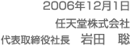

 
 

<!-- ■リード文■ -->
<TABLE CELLPADDING="0" CELLSPACING="0" BORDER="0" WIDTH="570">
	<TR><TD> 
		</TD></TR>
	<TR><TD CLASS="tx12">
		長期にわたりお付き合いいただきました「社長が訊くWiiプロジェクト」も本日を持って終了し、いよいよ、明日、日本での発売を迎えます。 
		 
		従来の延長線上にない全く新しいものを作り出すことにより「ゲーム人口を拡大する」という今回の長期間にわたる取り組みは、私たちにとっても経験したことのない大きなチャレンジでした。だからこそ、このWiiがどのように作られたかを、多くのみなさんにお伝えし、そして形として残したいと考えたわけです。貴重な出会いとチャンスを活かすことができたという幸運にも恵まれ、そして、社内外の多くの人達の力に支えられて、今振り返って「もう一度始めからやり直せたとしても、きっともう一度同じものを作るだろう」と思えるほど、不思議なほど悔いの残らない商品ができたとの達成感があります。 
		 
		一方で、発売直前になっての「Wii専用Ｄ端子ＡＶケーブル」の発売延期で楽しみにお待ちいただいていたお客さまや、直前での変更手配でご負担をおかけしてしまった流通関係者や小売店のみなさまにご迷惑をおかけしていることや、現在実現できたWiiの本体機能が、全て私たちの当初描いた理想通りに実現できているわけではないことなど、数多くの反省点もあります。また、商品は開発・製造して終わりではなく、お客様のお手元で期待通りに動作し、年齢・性別・ゲーム経験の有無を問わず誰にでも受け入れていただくことができるまではゴールに到達したとは言えません。その意味で、私たちの「Wiiプロジェクト」はまだ終わっていません。これからも、インターネット経由で本体をアップデートする機能を使って、私たちが考えてきた理想に少しでも近づけることができるように、そして、多彩なソフトやチャンネルが揃うことで最終的に家族誰もが自分に関係のある商品として毎日Wiiリモコンを触っていただくのが当たり前になる日が実現できるまで、私たちはチャレンジを続けていきます。 
		 
		最後までお付き合いいただきまして、ありがとうございました。
		</TD></TR>
	<TR><TD ALIGN="right">
		 
		</TD></TR>
</TABLE>
 

 
 
<TABLE CELLPADDING="0" CELLSPACING="0" BORDER="0" WIDTH="570">
	<TR><TD> <A HREF="../../../../corporate/links/index.html">社長が訊く リンク集</A></TD></TR>
</TABLE>
 

<!-- テキストリンク -->

<!-- FOOTER -->

<NOSCRIPT>
<UL>
<LI></LI>
</UL>
</NOSCRIPT>

<!-- bdr -->

<!-- bdr -->

</BODY>
</HTML>
