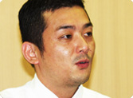

  <!-- ■人物紹介■ -->
<A NAME="intro">
<TABLE CELLPADDING="0" CELLSPACING="0" BORDER="0">

 
 
 
 

 
<TR>

 

岩田
: Wiiの中心には「チャンネル」という これまでのハードにはない構想があります。 その開発の経緯について、話していただきたいと思います。 まずは、個々のチャンネルではなく、 チャンネルの大きな枠組みについて関わった ３人のみなさんに集まっていただきました。 簡単に自己紹介していただけますか。まず、青山さんから。

青山
: はい。私は総合開発本部でグループマネージャーをやってます。 総合開発本部は、本来ハードを担当する部署なのですが、 私のグループでは、ＰＣでいうところのＯＳのような部分を 担当しています。

岩田
: 内部的には、ＩＰＬ、 「イニシャル・プログラム・ローダー」と呼んでいる部分ですね。

青山
: はい。Wiiの開発にあたっては、 そのＩＰＬの仕様や本体機能を決めるチームで責任者をつとめました。

岩田
: そのチームについては、のちほど詳しくお聞きします。 それでは、黒梅さん。

黒梅
: はい。私は、情報開発本部で、ひとつのソフトに限らず、 ユーザーインターフェイス全体を統括することを担当しています。 簡単に言いますと、ソフト全般のメニューまわりですとか、 ユーザーインターフェイスにまつわるデザインを手がけています。

岩田
: ようするに、何かのメニューを作るとなったら、 みんなが黒梅さんに相談に行くんですよね。 黒梅さんはハードの起動画面もだいたい手がけていますよね。

黒梅
: はい。ゲームキューブ、ニンテンドーＤＳと手がけまして、 今回のWiiが３つ目のハードになります。

岩田
: ハードを立ち上げて、最初に出る画面が黒梅さんの仕事です。 じゃあ、最後に玉樹さん。

玉樹
: はい。Wiiのメニューに関するディレクションと、 「WiiConnect24」の企画担当、 あと、本体機能に関するプロジェクトの補佐を担当しました。

岩田
: 玉樹さんは、Wiiのプロジェクトが オフィシャルにスタートする以前から、 任天堂がつぎに出すハードのコンセプトについて ずっと考えて続けてきた人ですよね。 おそらく、社内社外を問わず、 「Wiiのプレゼン」をいちばん多く経験した人かもしれません。

玉樹
: そうですね（笑）。

岩田
: ３人のみなさんは、大きくいうとＩＰＬ関連、 つまり「本体にどんな機能を持たせるか」というプロジェクトの 中心メンバーであるわけなんですが、 まず、ここでいう「本体の機能」というのがどういうものであるか、 既存のゲーム機に慣れたユーザーの方には ちょっとわかりづらいかもしれませんので、 青山さん、簡単に説明してもらえませんか。

青山
: はい。ＩＰＬについては、ニンテンドーＤＳの 起動直後の画面を思い浮かべていただけるとわかりやすいと思います。 ニンテンドーＤＳでは、電源を入れると、 本体に挿さっているソフトが起動するわけではなく、 ニンテンドーＤＳ本体のメニューが立ちあがります。 そこで、ユーザーが、ニンテンドーＤＳのソフト、 あるいは、ゲームボーイアドバンス用のソフト、 もしくは、本体に内蔵された『ピクトチャット』を選択します。 こういった、個々のソフトを呼び出す、本体側のソフトを ＩＰＬ（イニシャル・プログラム・ローダー）と呼んでいます。 さきほども言いましたが、パソコンでいうＯＳの部分ですね。 時刻の設定などの本体の設定もＩＰＬに含まれます。 ゲームキューブまでのＩＰＬというのは、 ほんとうにマシンの裏方として、ソフトを呼び出すことと、 本体の設定にまつわることを司っていたわけなんですが、 ニンテンドーＤＳからは、 『ピクトチャット』というソフトが本体に含まれたことにより、 より、ユーザーにとって大きな存在となりました。 Wiiでは、この機能が、さらに飛躍的に拡大されたと 思っていただければいいと思います。

岩田
: Wiiというハードは、本体そのものが さまざまな機能を持っているということですね。 そのひとつひとつの機能を決定するために、 我々は各部署間を横断するチームを作りました。

青山
: はい。Wiiの本体機能というのは、 ソフトともハードとも区別できない部分でしたから、 さまざまな部署から精鋭を25人ほど集めまして、 とにかくミーティングをくり返していきました。

岩田
: 私も可能な限り出席するようにしていましたが、 発足は、いつごろのことでしたかね？

青山
: たしか、去年の10月ごろだったと思います。 Ｗｉ-Ｆｉコネクションの開発が収束に向かってきて、 課題として各部署で検討されていた本体機能を 社内のオフィシャルプロジェクトのもとで 一気に形にしてしまおう、という感じで始まりました。

岩田
: そのリーダーに青山さんが指名されたわけですが、 その仕事が降りてきたとき、どう感じました？

青山
: いや、もう、たいへんだなあと思いました。

一同
: （笑）

青山
: 前例がないということもありますが、 考える枠組みそのものから話し合っていかなくてはならない ということがすごくたいへんでした。 「眠らないマシンにする」というコンセプトが決まったときに、 じゃあ「眠らないマシンで何をするのか」ということを、 具体的なサービスはもちろん、ネットワークインフラやサーバーの 問題も含めていちから話し合っていきましたので。

岩田
: プロジェクトの立ち上げのときに、 自分に与えられたミッションは具体的にどんなことでしたか？

青山
: ええっとですね、どうでしょうね（笑）。 いえ、もう、つねにいろんなことを考えてましたので、 ええっと、いまクリアーに言えないですね（笑）。

岩田
: ああ、そうですか（笑）。 玉樹さんと黒梅さんはどうですか？

玉樹
: 最初のミッションですか？ うわあ……とにかくいっぱいいっぱいだった時期ですからね。

一同
: （笑）

玉樹
: どんなことをやりたいかということを 全員でまず話したような覚えがありますが、 最初のミッションというと……

岩田
: 黒梅さんは（笑）？

黒梅
: 完全に頭からなくなっちゃってますね。

一同
: （笑）

岩田
: まあ、それくらいいろんなことを考えて、 いまの仕様が導かれたということにしておきましょう（笑）。 黒梅さんは、これまでにもＩＰＬに関わってきたわけですが、 のちに「チャンネル」と呼ばれるWiiの本体機能を考えることは、 これまでのハードと比べてどういうところが特殊でしたか？

黒梅
: やはり、最終的な形態がどうなるかということが まったく想像できないなかで始めたことですね。 ニンテンドーＤＳのときなどは、 やりたいことを全部は入れられないから 潔く切っていこうということで苦労した覚えがあるんですけど、 Wiiの場合は、どういうものになるのかわからないものを とにかくまとめていかなきゃいけない。 しかも、その責任の大きさだけはわかっているという状態で。

一同
: （笑）

黒梅
: いちばん最初のころのことまでさかのぼると、 やっぱり、玉樹くんからずっといろんな提案を受けてまして、 こんなふうにしたいとか、こういうハードであるべきだ、とか……。 その、「熱いこと」をずっと聞かされてまして（笑）。

岩田
: 玉樹くんって、「熱い」んですよね（笑）。

玉樹
: すいません、恥ずかしい（笑）。

岩田
: いえ、私は、その「熱さ」はWiiのプロジェクトに すごく貢献したと思っていますよ。 どういうことを当初は語っていたんですか。

玉樹
: まず、あの、さかのぼるとぼくは、入社したときの挨拶で 「おばあちゃんといっしょにできるようなゲームを作りたい」 と言っていたことがありまして、ずっとイメージとしてあったのが、 「こたつとゲーム」が馴染んでいる風景だったんです。 もちろん、こたつでもちゃぶ台でもテーブルでもなんでもいいんですが 家族全員で共有できるような楽しみにしたかったんです。 とくに、自分でも最近、ゲームで遊ぶときには、 夜、ひとりの部屋で、気合を入れてゲーム機を立ち上げるっていう、 ちょっと世間と隔絶されるような感じがあったものですから、 そのあたりを変えていきたいというか、 遊ぶときに寂しくならないようなものを目指したかったんです。 ですから、Wiiのリモコンが ふつうにこたつの上に置いてあるようなイメージ、 そういうことを実現させるためにどうしたらいいのかということを ずっといろんな人に話していたように思います。 本体機能のプロジェクトでも同じようなビジョンを話していました。

岩田
: 本体機能を決める会議では、 どういったことから話し合われていったんでしょうか。

黒梅
: いや、もう、ほんとうにいろんなことを（笑）。 たとえば、文字入力はどのスタイルがいちばんいいのかということで、 『どうぶつの森』方式を試してみたり、 画面にフルキーボードを出してみたり、 携帯電話のスタイルを取り入れてみたり……。

玉樹
: 純粋に、「起動をもっと速くできないか」という技術的な話を 延々と話し合ったりもしていましたね。 この画面であと何秒稼げるか、とか、そういう話を。

青山
: そういう話をくり返していく中で、 徐々にコンセプトがはっきりとイメージできてきたんですが、 それはやはり「家族全員で触るものだ」ということでした。 だとすると、家族の誰も敵にしてはいけないし、 家族の中に「よくわからない」とか 「自分と関係ない」とか感じる人がいてはいけない。 これまでのゲームという娯楽でありがちだった、 何か気に入ったゲームがあったら何時間でも遊ぶけれど、 それをクリアーしてしまったら生活からなくなってしまう、 というものであってはいけないんだろうな、と。

玉樹
: ひとりが好きなゲームを好きなだけ遊んでいるだけでは 家族みんなに触ってもらえないし、 ゲームをやっていない人がどんどん巻き込まれるということが 起こらなくなってしまうんですよね。

青山
: ですから、とにかく、「全員に触ってもらうこと」、 そして、「毎日電源を入れてもらうこと」、 そのコンセプトから離れないようにということで 話し合っていきました。

岩田
: たとえば、いま残っている仕様の中で、 いちばん最初に形になったものがなんだったか覚えていますか。

黒梅
: 厳密に最初だったかどうかはちょっとわかりませんが、 たとえば「天気」というチャンネルは Wiiが24時間つながっているということを わかりやすく表すものとして仕上がったことが印象に残っています。 朝起きて、パッと電源を入れると、 今日の天気の情報が更新されている。 これは、Wiiをよく知らない人に説明するときも、 すごく伝えやすかったというか、 すぐ理解していただける機能として、手応えがありました。

岩田
: たしかに「天気」や「ニュース」は、わかりやすい形として、 「家族全員」に「毎日新しいもの」として伝わりますね。 さて、そういった個々のチャンネルの企画が どのようにしていまの形にまとまっていったのかを 聞いていきたいと思います。 

<TD CLASS="tx12" COLSPAN="2" ALIGN="right">
<TABLE CELLPADDING="0" CELLSPACING="3" BORDER="0">
<TR>
<A HREF="

02.html">第２回「ゲーム機とユーザーの関係を変える」へ

 

<TD WIDTH="170" ALIGN="right">

<!-- ■インデックス■ -->

<TR><TD COLSPAN="3" BACKGROUND="../../../img_cmn/dotline_h.gif">
<TR><TD WIDTH="1" BACKGROUND="../../../img_cmn/dotline_v.gif">
<TD WIDTH="618">

 <TABLE CELLPADDING="0" CELLSPACING="3" BORDER="0">
<TR>
: 第１回 「家族全員に触ってもらうこと」 
<TR>
<A HREF="

../vol3/02.html">第２回 「ゲーム機とユーザーの関係を変える」
<TR>
<A HREF="

../vol3/03.html">第３回 「Wiiは家族のパブリックスペースなんです」
<TR>
<A HREF="

../vol3/04.html">第４回 「世界中のMiiが交流するという野望を持っています」
<TR>
<A HREF="

../vol3/05.html">第５回 「テレビでデジカメの写真を見る行為自体が新鮮」
<TR>
<A HREF="

../vol3/06.html">第６回 「お互いがお互いに影響を与え合っている感じ」

 
<TABLE CELLPADDING="0" CELLSPACING="3" BORDER="0">
<TR>
<TD CLASS="txtlink_off"> <A HREF="../../../../corporate/links/index.html">社長が訊く リンク集

<TD WIDTH="1" BACKGROUND="../../../img_cmn/dotline_v.gif">
<TR><TD COLSPAN="3" BACKGROUND="../../../img_cmn/dotline_h.gif">

 <!-- テキストリンク -->

