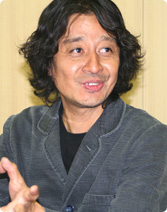
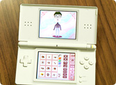
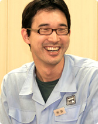

  

 

岩田
: 最初に発売された『メイド イン ワリオ』は、 必ずしも営業的な期待が高い商品 というわけではありませんでしたよね。 しかし、ニンテンドーＤＳ、そしてWiiと、 いまやハードのロンチに『ワリオ』シリーズは なくてはならないタイトルに成長しています。 この変化は、作っている立場からすると ちょっと愉快じゃないですか？

坂本
: たしかに、そうですね。 最初は「一発芸」みたいに思われていたのに、 ニンテンドーＤＳのときなんかは、 「これは『ワリオ』のためにあるようなハードだ」 みたいなことを言われて（笑）。 ですから、Wiiのロンチに関しては、じつは、 言われる前から「やるぞ」という気でいたんです。 そういうシリーズになるとは、 一作目のときはまったく思いませんでしたね。

阿部
: 一作目のときというのは、 『ワリオ』単体がどうこういうより、 任天堂の雰囲気自体が違っていたと思うんです。 なんというか、任天堂が、 任天堂ブランド的なゲームばかりを 作っているようなイメージが 社内にも社外にもあったと思うんですね。 そういう中で『メイド イン ワリオ』というのは、 亜流というか、亜流なら亜流なりの楽しさを、 という気持ちから生まれたソフトで。

岩田
: 『メイド イン ワリオ』を作っていた当時、 「任天堂ができないことをやろう」と よく言っていたことを私も覚えています。

坂本
: はい、そうでしたね。

阿部
: 作りながら、 「これ、任天堂が出していいのかな」って ちょっとドキドキしていたくらいで（笑）。

岩田
: うん、下品ですからね（笑）。

一同
: （笑）

坂本
: ですから、スタッフのノリというのは 一作目からすごくよかったんです。 明らかにこういうものを作りたい人が こういうことをやるんだ、ということで すごく集中して作っていたと思います。 ただ、それをどうパッケージすれば 本当に売れるものになるのか、 自分たちの「らしさ」を保ったうえで どう商品にすればいいのかというのが 不安というか、悩みだったんですね。

岩田
: おもしろいことに、一作目の『ワリオ』を どう売り出せばいいのかということを すごく一生懸命考えていたのが 宮本（茂）さんだったんですよね。 「任天堂ができないことをやる」というのは、 極端にいうと「宮本さんが作りそうもないものを」 という意味でもあるわけで、 そういう考えから生まれた「亜流」を、 誰よりも宮本さんが売ろうとしていたというのは 非常におもしろいところですね。

坂本
: たしか「最多 最短 最速」というコピーは、 宮本さんが推してくださったんですよね。

岩田
: そうです。 宮本さんがすごく強くそれをパッケージに 「書け、書け」と主張したんですよ。

坂本
: けっこうもっと過激なことを言ってもいいぐらい、 「最低！」とかでもいいんじゃないかと 言うてはったのを覚えてますね（笑）。

岩田
: あのとき、宮本さんは、 この不思議なおもしろさを持つ 『メイド イン ワリオ』というソフトを たくさんある商品の中に いかに埋没させずにアピールしていくか、 ということにすごく肩入れしていたんですよね。 それが、結果的にこうやって、 ハードのロンチに欠かせないソフトに成長し、 なにより「幅広い層へアピールする手軽なソフト」の さきがけになったというのが、とても興味深いですね。 宮本さんが自分では作らないようなものを ほかならぬ宮本さん自身が求めていたというか。 思えば「似顔絵チャンネル」ができた経緯も、 それとよく似ているかもしれませんね。

坂本
: ああ、なるほど。

岩田
: 坂本さんたちのチームが ニンテンドーＤＳ用のタイトルとして作っていた あるソフトを見せて貰ったとき、 それは常々、宮本さんが 「こういうものがあるといいんですよね」と 言っていたものそのものだったんです。 それで、私がそれを宮本さんに見せて 「宮本さんが求めているのは こういうものじゃないですか」と提案したら、 あっという間に話が進んで、 Wiiの「似顔絵チャンネル」になったという。

坂本
: あのときはびっくりしましたよ。 出張明けに会社に行ったら、スタッフが、 「岩田さんと宮本さんとが来て、 なんか、たいへんなことになってますよ」 って言われて。 「ぼく、なんか悪いことしたかな？」 って、すごく不安で……。

岩田
: （笑）

阿部
: 今日は、そのソフトを持ってきました。 もちろん開発途中のものですが……これです。

岩田
: 「似顔絵チャンネル」の基本的な構造って すでにこの中に全部入ってるんですよね。 簡単な操作でいろんな顔を作るということも、 直感的なインターフェイスもすごくうまくいってる。 宮本さんはこういう「分身」を作りたがっていて、 「データを小さくして、たくさんゲームの中に入れたい」 とも言ってましたから、これがまさにぴったりで。

坂本
: 宮本さんがこういうものを求められてるというのは、 正直、ぼくらはわかってなかったんですよ。 で、これも、とくに似顔絵だけを 作ろうしていたわけじゃなくて、 単にアバター的なものを作って、 それをソフトの中にどんどん登録していく というような仕組みのものとして考えていたんです。 だから、似顔絵の機能も、最初は 目とか鼻とか口をモンタージュ的に 並べていくだけのものだったんですが、 いざ、ぼくが自分の顔を作ろうとしたときに、 その、ぼくの顔のパーツがなかったんですね（笑）。 「ぼくの目はもっと大きくて垂れてんのに、 パーツがないなぁ……」ということで、 「これ、パーツのサイズを変えたり 角度を変えたりできないの？」 ということになって。

岩田
: それがじつは大発明だったんですよ。 その発想がなければ「似顔絵チャンネル」も 「Mii」もないわけですから、 Wiiも違ったマシンになっていたはずなんです。

坂本
: 言うてみるもんですね。 単に自分の顔が作れなかっただけなんですが（笑）。 あの、ぼく、スタッフにこう言ったんですよ。 「規格外の顔も作れるようにしてくれ」って。

岩田
: 「規格外の顔」（笑）。 そのひと言がなければ今のWiiはないんですよ。

阿部
: ということは、つまり、 坂本さんの顔がふつうの顔だったら、 今のWiiはなかったんですね。

坂本
: そやね。って、コラ。

岩田
: でも、まあ、そういうことです（笑）。

坂本
: いや、まあ、そうですね。 ぼくの顔も規格外だし、その意味でいうと 世間にはもっと規格外の人もいるので（笑）。 パーツを変化させられるようにしないとダメだと いろいろ要望を出していたら、 わりといろんな顔が作れるようになって。

岩田
: そこでソフトが「おもしろく」なったんですよね。 おもしろくなってないと、坂本さんも 私にこのソフトを見せにこなかったでしょうから。

阿部
: やはり坂本さんの規格外の顔がWiiを変えたと。

坂本
: そういうことやね。もうええわ。

岩田
: それがぐるっと一周回って、 『ワリオ』の中にも「似顔絵チャンネル」の機能が 活きているからまたおもしろいですよね。 ちなみに『ワリオ』の中に「Mii」が どういうふうに登場するか、説明してもらえますか。

阿部
: ゲームの最初に、名前を登録するときに、 自分のMiiを選ぶことができるんですけど、 それがプチゲームの中に ちょこちょこと顔を出すようになってます。 たとえば、顔が自分のMiiで、 体がバネになった人形のようなものが出てくるんですね。 ようするに、「バネ人形になった自分」です。 で、<A HREF="movie01.html" TARGET="_blank" CLASS="movie_link" onClick="openWin('movie01.html',400,350,'menubar=1,resizable=1'); return false;">そこにボールが飛んでくるので、 こう、作法棒を頭の上にかまえて、 ──「チョンマゲ」の状態ですね── 体をくねらせてよけるんです。 そうすると、画面の中の自分も、 体をくねらせてボールをよけるという。

岩田
: あのプチゲームはやっぱり 自分の似顔絵になることによって 明らかに手応えが変わりましたよね。

阿部
: ぜんぜん感覚が違うんですよね（笑）。

岩田
: 「あ、オレだ」って（笑）。

坂本
: 一生懸命になります（笑）。

阿部
: やられたらすごく悔しいんですよね（笑）。 まあ、基本的に『ワリオ』におけるMiiは、 そういう「隠し味」みたいな使い方をしています。

坂本
: 後ろ姿で出てきたりするのが けっこうおもしろいんですよ。 一生懸命、画面の中の人形を操作して、 失敗したときにその人形が振り返ったら、 自分やった、とか（笑）。

岩田
: いいですね、そういうの（笑）。

坂本
: くだらないですか？

岩田
: うん。「くだらねぇ」（笑）。

一同
: （笑）

岩田
: じゃ、最後に、楽しみに待ってくださっているお客さんに 作り手からのメッセージをひと言ずつ、お願いします。

<A HREF="movie01.html" TARGET="_blank" onClick="openWin('movie01.html',400,340,'menubar=1,resizable=1'); return false;">

阿部
: はい。これまでの『ワリオ』というのは、 おもに携帯機でリリースしていたということもあって、 ひとりで遊ぶときの楽しさを追求していたんですけど、 今回はわりとゲームというよりも遊びとしてというか、 みんなで遊ぶための道具としての 役割をすごく重視して作ったので、 もちろん、ひとりで遊んでも楽しめますけれども、 できるだけ人を呼んで、恥ずかしさとかを捨てて、 思い切って遊んでもらいたいなというふうに思ってます。

坂本
: 本当に、やってる人も見てる人も楽しいソフトです。 まわりで見ている人がツッコミ入れたりとか、 そういうゲームの外にある部分も楽しめると思いますので 遊び道具というか、パーティーグッズとして いろんな場所で楽しんでいただければと思います。 クリスマスはもちろん、お正月は親戚一同で、 おじいちゃんもおばあちゃんもいっしょにスクワットして、 がんばっていただければと思います（笑）。

岩田
: つまり、この『おどる メイド イン ワリオ』というのは、 たった１個のコントローラとたった１個のテレビ画面が その場にいる人みんなをニコニコさせるものなんですね。 そういうものを作りましたので、 それを味わってください、ってことなんでしょうね。 ……いや、しかし、あきれるほど 「こういう部分がたいへんでした！」という 苦労話の出ないインタビューになりましたね（笑）。

一同
: （笑）

岩田
: もちろん、楽に作っているという感じは まったくしないんですけど。 なんていうか、疲れてるけれども、 悲壮感がないというのかな。 なんか、無条件にニコニコしてるんですよね、 『ワリオ』チームの人たちは。

坂本
: それは『ワリオ』チームの常ですね。 まあ、ぼくの知らないとこで現場のスタッフは いろいろ泣いてるかもしれませんけど（笑）。 でも、開発を終えてみて、結果的には すごくスムーズにいろんなことが 楽しくできたという印象がありますね。 まあ、たしかにみんな、疲れてるとは思うんですけども、 楽しそうにやってくれてるのも伝わってきますし、 そういう意味では本当によかったなと思ってます。

岩田
: まあ、現実には、 苦労しないでものができるはずはないんですけどね。 ただ、現場のスタッフに悲壮感が漂わないところが みんながニコニコ笑って遊べる商品に 仕上がる理由なんじゃないかなと。

坂本
: ですね。けっこう出ちゃいますもんね、 作り手の空気みたいなものって。 みんなが素直に楽しんでやってる部分が ゲームに出ているとしたら、 こんなにうれしいことはないですね。

岩田
: いや、だって、鼻に指入れるゲームでね、 「苦労したぞ！」というオーラが 出ててもしょうがないですもんね！

一同
: （笑） 

<TD CLASS="tx12" COLSPAN="2" ALIGN="right">
<TABLE CELLPADDING="0" CELLSPACING="3" BORDER="0">
<TR>
<A HREF="

../afterword/index.html">『おわりに』へ
 

<TD WIDTH="170" ALIGN="right">

<!-- ■インデックス■ -->

<TR><TD COLSPAN="3" BACKGROUND="../../../img_cmn/dotline_h.gif">
<TR><TD WIDTH="1" BACKGROUND="../../../img_cmn/dotline_v.gif">
<TD WIDTH="618">

 <TABLE CELLPADDING="0" CELLSPACING="3" BORDER="0">
<TR>
<A HREF="

index.html#intro">第１回 「『リモコンひとつあれば、なんでもできるぞ！』と」
<TR>
<A HREF="

02.html">第２回 「『くだらねぇ』は最高の褒め言葉」
<TR>
<A HREF="

03.html">第３回 「見ている人に『ちょっと俺に貸せ』と言わせたい」
<TR>
: 第４回 「その場にいる人みんなをニコニコさせる」

 
<TABLE CELLPADDING="0" CELLSPACING="3" BORDER="0">
<TR>
<TD CLASS="txtlink_off"> <A HREF="../../../../corporate/links/index.html">社長が訊く リンク集

<TD WIDTH="1" BACKGROUND="../../../img_cmn/dotline_v.gif">
<TR><TD COLSPAN="3" BACKGROUND="../../../img_cmn/dotline_h.gif">

 <!-- テキストリンク -->

