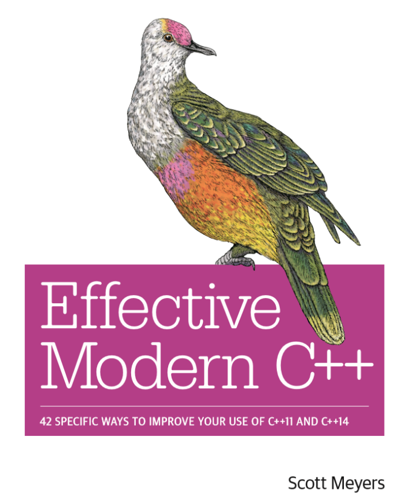

{:.border.border-radius}

> ! 2017.10开始更新 
> ! 标注“已修订”的章节表示已经没有大致的错误 
> ! 我没有版权，我没有版权，我没有版权 
> ! 本书要求读者具有C++基础 
> ! 未翻译的条款名称现在直译，翻译时可能适当修改 
> ! [PDF格式英文版下载](https://github.com/kelthuzadx/EffectiveModernCppChinese/blob/master/0.Public/EffectiveModernCpp.pdf),仅供翻译参考 

## 目录
1. __类型推导__
	1. [Item 1:理解模板类型推导](https://benbenzi.space/others/EffectiveModernCppChinese/1.DeducingTypes/item1/) 已修订
	2. [Item 2:理解auto类型推导](https://benbenzi.space/others/EffectiveModernCppChinese/1.DeducingTypes/item2/)
	3. [Item 3:理解decltype](https://benbenzi.space/others/EffectiveModernCppChinese/1.DeducingTypes/item3/)
	4. [Item 4:学会查看类型推导结果](https://benbenzi.space/others/EffectiveModernCppChinese/1.DeducingTypes/item4/)
2. __auto__
	1. [Item 5:优先考虑auto而非显式类型声明](https://benbenzi.space/others/EffectiveModernCppChinese/2.Auto/item5/)
	2. [Item 6:auto推导若非己愿，使用显式类型初始化惯用法](https://benbenzi.space/others/EffectiveModernCppChinese/2.Auto/item6/)
3. __移步现代C++__
	1. [Item 7:区别使用()和{}创建对象](https://benbenzi.space/others/EffectiveModernCppChinese/3.MovingToModernCpp/item7/)
	2. [Item 8:优先考虑nullptr而非0和NULL](https://benbenzi.space/others/EffectiveModernCppChinese/3.MovingToModernCpp/item8/)
	3. [Item 9:优先考虑别名声明而非typedefs](https://benbenzi.space/others/EffectiveModernCppChinese/3.MovingToModernCpp/item9/)
	4. [Item 10:优先考虑限域枚举而非未限域枚举](https://benbenzi.space/others/EffectiveModernCppChinese/3.MovingToModernCpp/item10/) 已修订
	5. [Item 11:优先考虑使用deleted函数而非使用未定义的私有声明](https://benbenzi.space/others/EffectiveModernCppChinese/3.MovingToModernCpp/item11/)
	6. [Item 12:使用override声明重载函数](https://benbenzi.space/others/EffectiveModernCppChinese/3.MovingToModernCpp/item12/)
	7. [Item 13:优先考虑const_iterator而非iterator](https://benbenzi.space/others/EffectiveModernCppChinese/3.MovingToModernCpp/item13/)
	8. [Item 14:如果函数不抛出异常请使用noexcept](https://benbenzi.space/others/EffectiveModernCppChinese/3.MovingToModernCpp/item14/)
	9. [Item 15:尽可能的使用constexpr](https://benbenzi.space/others/EffectiveModernCppChinese/3.MovingToModernCpp/item15/)
	10. [Item 16:让const成员函数线程安全](https://benbenzi.space/others/EffectiveModernCppChinese/3.MovingToModernCpp/item16/) 由 @windski贡献
	11. [Item 17:理解特殊成员函数函数的生成](https://benbenzi.space/others/EffectiveModernCppChinese/3.MovingToModernCpp/item17/) 
4. __智能指针__
	1. [Item 18:对于独占资源使用std::unique_ptr](https://benbenzi.space/others/EffectiveModernCppChinese/4.SmartPointers/item18/) 由 @wendajiang贡献
	2. [Item 19:对于共享资源使用std::shared_ptr](https://benbenzi.space/others/EffectiveModernCppChinese/4.SmartPointers/item19/) 已修订
	3. [Item 20:当std::shard_ptr可能悬空时使用std::weak_ptr](https://benbenzi.space/others/EffectiveModernCppChinese/4.SmartPointers/item20/) 更新完成
	4. [Item 21:优先考虑使用std::make_unique和std::make_shared而非new](https://benbenzi.space/others/EffectiveModernCppChinese/4.SmartPointers/item21/) 由 @pusidun贡献
	5. [Item 22:当使用Pimpl惯用法，请在实现文件中定义特殊成员函数](https://benbenzi.space/others/EffectiveModernCppChinese/4.SmartPointers/item22/) 由 @BlurryLight贡献
5. __右值引用，移动语义，完美转发__
	1. [Item 23:理解std::move和std::forward](https://benbenzi.space/others/EffectiveModernCppChinese/5.RRefMovSemPerfForw/item23/) 由 @BlurryLight贡献
	2. [Item 24:区别通用引用和右值引用](https://benbenzi.space/others/EffectiveModernCppChinese/5.RRefMovSemPerfForw/item24/) 由 @BlurryLight贡献
	3. [Item 25:对于右值引用使用std::move，对于通用引用使用std::forward](https://benbenzi.space/others/EffectiveModernCppChinese/5.RRefMovSemPerfForw/item25/)由 @wendajiang贡献
	4. [Item 26:避免重载通用引用](https://benbenzi.space/others/EffectiveModernCppChinese/5.RRefMovSemPerfForw/item26/) 由 @wendajiang贡献
	5. [Item 27:熟悉重载通用引用的替代品](https://benbenzi.space/others/EffectiveModernCppChinese/5.RRefMovSemPerfForw/item27/) 由 @wendajiang贡献
	6. [Item 28:理解引用折叠](https://benbenzi.space/others/EffectiveModernCppChinese/5.RRefMovSemPerfForw/item28/) 由 @wendajiang贡献
	7. [Item 29:认识移动操作的缺点](https://benbenzi.space/others/EffectiveModernCppChinese/5.RRefMovSemPerfForw/item29/) 由 @wendajiang贡献
	8. [Item 30:熟悉完美转发失败的情况](https://benbenzi.space/others/EffectiveModernCppChinese/5.RRefMovSemPerfForw/item30/) 由 @wendajiang贡献
6. __Lambda表达式__
	1. [Item 31:避免使用默认捕获模式](https://benbenzi.space/others/EffectiveModernCppChinese/6.LambdaExpressions/item31/) 由 @LucienXian贡献
	2. [Item 32:使用初始化捕获来移动对象到闭包中](https://benbenzi.space/others/EffectiveModernCppChinese/6.LambdaExpressions/item32/) 由 @LucienXian贡献
	3. [Item 33:对于std::forward的auto&&形参使用decltype](https://benbenzi.space/others/EffectiveModernCppChinese/6.LambdaExpressions/item33/) 由 @LucienXian贡献
	4. [Item 34:优先考虑lambda表达式而非std::bind](https://benbenzi.space/others/EffectiveModernCppChinese/6.LambdaExpressions/item34/) 由 @LucienXian贡献
7. __并发API__
	1. [Item 35:优先考虑基于任务的编程而非基于线程的编程](https://benbenzi.space/others/EffectiveModernCppChinese/7.TheConcurrencyAPI/Item35/) 由 @wendajiang贡献
	2. [Item 36:如果有异步的必要请指定std::launch::threads](https://benbenzi.space/others/EffectiveModernCppChinese/7.TheConcurrencyAPI/item36/) 由 @wendajiang贡献
	3. [Item 37:从各个方面使得std::threads unjoinable](https://benbenzi.space/others/EffectiveModernCppChinese/7.TheConcurrencyAPI/item37/) 由 @wendajiang贡献
	4. [Item 38:关注不同线程句柄析构行为](https://benbenzi.space/others/EffectiveModernCppChinese/7.TheConcurrencyAPI/item38/) 由 @wendajiang贡献
	5. [Item 39:考虑对于单次事件通信使用void](https://benbenzi.space/others/EffectiveModernCppChinese/7.TheConcurrencyAPI/item39/) 由 @wendajiang贡献
	6. [Item 40:对于并发使用std::atomic，volatile用于特殊内存区](https://benbenzi.space/others/EffectiveModernCppChinese/7.TheConcurrencyAPI/item40/) 由 @wendajiang贡献
8. __微调__
	1. [Item 41:对于那些可移动总是被拷贝的形参使用传值方式](https://benbenzi.space/others/EffectiveModernCppChinese/8.Tweaks/item41/) 由 @wendajiang贡献
	2. [Item 42:考虑就地创建而非插入](https://benbenzi.space/others/EffectiveModernCppChinese/8.Tweaks/item42/) 由 @wendajiang贡献

## 其他资源
+ 本书[PDF格式的中文版](https://github.com/kelthuzadx/EffectiveModernCppChinese/blob/master/0.Public/translated/translate-zh-combine.pdf)见于此，该版本通常同步或者滞后于当前Markdown文档
+ [Effective C++ Xmind Doc](./0.Public/EffectModernC++.xmind)

## 贡献者

感谢所有参与翻译/勘误/建议的贡献者们~

## 赞助翻译

 🙏 [[Become a backer](https://opencollective.com/EffectiveModernCppChinese#backer)]

